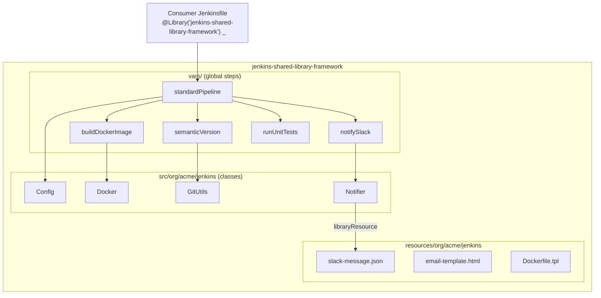

# Jenkins Shared Library Framework

A reusable, opinionated [Jenkins Shared Library](https://www.jenkins.io/doc/book/pipeline/shared-libraries/)
that gives every team the same battle-tested CI/CD building blocks — an
end-to-end declarative pipeline, Docker image builds, semantic versioning,
Slack notifications and test publishing — behind a handful of clean pipeline
steps.

[](LICENSE)
[](.github/workflows/ci.yml)
[](https://www.jenkins.io/doc/book/pipeline/shared-libraries/)
[](https://groovy-lang.org/)

## Overview

Copy-pasting `Jenkinsfile` logic between repositories quickly becomes a
maintenance nightmare: every project drifts, security fixes have to be applied
in dozens of places, and onboarding a new service means recreating the same
pipeline by hand. A Jenkins Shared Library solves this by publishing pipeline
logic as versioned Groovy that any `Jenkinsfile` can load with a single
`@Library(...)` annotation.

This framework packages the common delivery lifecycle into small, composable
global steps (`vars/`) backed by unit-tested Groovy classes (`src/`) and
resource templates (`resources/`). A consuming project can adopt the whole
opinionated pipeline with `standardPipeline(appName: 'my-service')`, or cherry
-pick individual steps such as `buildDockerImage` and `notifySlack` inside a
bespoke pipeline.

It is aimed at platform / DevOps teams who operate a shared Jenkins controller
and want consistent, auditable, DRY pipelines across many application
repositories.

## Architecture



**Components**

- **`vars/`** — global pipeline steps, each a `.groovy` with a `call(...)`
  method plus a `.txt` doc file surfaced in Jenkins' "Global Variable Reference".
- **`src/org/acme/jenkins/`** — plain Groovy classes holding the reusable logic
  (`Config`, `Docker`, `GitUtils`, `Notifier`), kept unit-testable.
- **`resources/`** — non-Groovy assets loaded at runtime with `libraryResource`.
- **`examples/`** — example consumer `Jenkinsfile`s.
- **`test/`** — Spock specs exercising the `src/` classes.

## Features

- One-line, end-to-end declarative pipeline via `standardPipeline`.
- Docker image build/login/push with credential handling.
- Automatic SemVer derivation from git tag history.
- Colour-coded Slack notifications rendered from a resource template.
- Unit-test execution and JUnit publishing for Gradle, Maven and npm.
- Typed, validated configuration object with sensible defaults.
- CI that lints Groovy (`npm-groovy-lint`) and YAML, and validates the
  library's structure.

## Tech Stack

| Layer          | Technology                                   |
| -------------- | -------------------------------------------- |
| Language       | Groovy (Jenkins Pipeline CPS DSL)            |
| Runtime        | Jenkins (Pipeline + Global Pipeline Library) |
| Testing        | Spock                                        |
| Linting        | npm-groovy-lint, yamllint                    |
| CI             | GitHub Actions                               |

## Getting Started

### Prerequisites

- A Jenkins controller (2.4xx+) with the **Pipeline** and
  **Pipeline: Groovy Libraries** plugins installed.
- Agents with `docker`, `git` and `curl` available for the relevant steps.
- Jenkins credentials for the container registry (`registry-creds`) and the
  Slack webhook (`slack-webhook`).

### Configure the library in Jenkins (Global Pipeline Libraries)

1. Go to **Manage Jenkins → System → Global Pipeline Libraries**.
2. Add a library:
   - **Name:** `jenkins-shared-library-framework`
   - **Default version:** `main` (or a release tag such as `v0.1.0`)
   - **Retrieval method:** *Modern SCM* → *Git*
   - **Project repository:** this repository's clone URL
3. (Recommended) enable **Load implicitly** only if every job should get it
   automatically; otherwise load it per-`Jenkinsfile` (see below).

### Use it from a Jenkinsfile

```groovy
@Library('jenkins-shared-library-framework') _

standardPipeline(
    appName:      'payments-api',
    registry:     'registry.example.com',
    buildTool:    'gradle',
    slackChannel: '#deployments',
    deployBranch: 'main',
    deployEnv:    'production'
)
```

See [`examples/Jenkinsfile`](examples/Jenkinsfile) and
[`examples/Jenkinsfile.advanced`](examples/Jenkinsfile.advanced) for a full
all-in-one pipeline and a hand-composed one.

### Local development

```bash
make help          # list targets
make lint          # groovy + yaml lint (uses tools if installed)
make lint-groovy   # npm-groovy-lint over vars/ and src/
make lint-yaml     # yamllint over .github and pre-commit config
make clean         # remove build/report artifacts
```

## Available Steps (`vars/`)

| Step                | Purpose                                          | Example |
| ------------------- | ------------------------------------------------ | ------- |
| `standardPipeline`  | Full declarative build/test/package/deploy flow  | `standardPipeline(appName: 'api')` |
| `buildDockerImage`  | Build and optionally push a Docker image         | `buildDockerImage(image: 'reg/api', tag: '1.0.0', push: true)` |
| `semanticVersion`   | Derive a SemVer string from git tags             | `def v = semanticVersion(prefix: 'v')` |
| `runUnitTests`      | Run tests and publish JUnit results              | `runUnitTests(tool: 'gradle', coverage: true)` |
| `notifySlack`       | Post a colour-coded status message to Slack      | `notifySlack(channel: '#ci', status: 'SUCCESS', message: 'done')` |

## Project Structure

```text
jenkins-shared-library-framework/
├── vars/                              # Global pipeline steps (+ .txt docs)
│   ├── standardPipeline.groovy
│   ├── buildDockerImage.groovy
│   ├── notifySlack.groovy
│   ├── semanticVersion.groovy
│   └── runUnitTests.groovy
├── src/org/acme/jenkins/              # Reusable Groovy classes
│   ├── Config.groovy
│   ├── Docker.groovy
│   ├── GitUtils.groovy
│   └── Notifier.groovy
├── resources/org/acme/jenkins/        # Assets loaded via libraryResource
│   ├── slack-message.json
│   ├── email-template.html
│   └── Dockerfile.tpl
├── examples/                          # Example consumer Jenkinsfiles
├── test/vars/                         # Spock unit specs
├── .github/workflows/ci.yml           # Lint + structure CI
└── Makefile
```

## Configuration

`standardPipeline` accepts the following keys (resolved by
`org.acme.jenkins.Config`):

| Key              | Default                   | Description                              |
| ---------------- | ------------------------- | ---------------------------------------- |
| `appName`        | *(required)*              | Application / service name               |
| `registry`       | `registry.example.com`    | Container registry host                  |
| `buildTool`      | `gradle`                  | `gradle` \| `maven` \| `npm`             |
| `dockerfile`     | `Dockerfile`              | Path to the Dockerfile                   |
| `tagPrefix`      | `v`                       | Git tag prefix for versioning            |
| `deployBranch`   | `main`                    | Branch allowed to deploy                 |
| `deployEnv`      | `staging`                 | Target environment name                  |
| `slackChannel`   | `''`                      | Slack channel (empty disables Slack)     |
| `runTests`       | `true`                    | Run the unit-test stage                  |
| `coverage`       | `false`                   | Collect coverage                         |
| `pushImage`      | `true`                    | Push the built image                     |
| `deploy`         | `true`                    | Enable the deploy stage                  |
| `timeoutMinutes` | `60`                      | Overall pipeline timeout                 |

Credentials are read from the Jenkins credentials store: `registry-creds`
(username/password) and `slack-webhook` (secret text).

## Deployment

This project is not a deployable service; it is consumed by other pipelines.
"Deployment" means publishing a new version:

1. Land changes on `main` (CI must be green).
2. Tag a release, e.g. `git tag v0.1.0 && git push origin v0.1.0`.
3. Point the Global Pipeline Library **Default version** at the new tag, or let
   consumers pin `@Library('jenkins-shared-library-framework@v0.1.0')`.

Pinning to tags gives consumers reproducible pipelines and a controlled upgrade
path.

## Contributing

Contributions are welcome — please read [CONTRIBUTING.md](CONTRIBUTING.md) and
our [Code of Conduct](CODE_OF_CONDUCT.md). Every new `vars/` step must ship with
a matching `.txt` documentation file, and names must stay consistent across the
README, examples, `vars/`, `src/` and `resources/`.

## Security

See [SECURITY.md](SECURITY.md) for how to report vulnerabilities. Never hardcode
secrets in pipeline code — always use the Jenkins credentials store.

## License

Released under the [MIT License](LICENSE).
